# 202130414 심민우

## 6월5일(14주차)

### 기존 프로젝트에 React 추가하기

[2단계: 페이지 어디에서든 React 컴포넌트 렌더링하기 ]

- 이전 단계에서는 , 메인 메일 파일 최상단에 아래 코드를 넣었습니다.

```javascript
import { createRoot } from "react-dom/client";
// 기존 HTML 컨텐츠를 지웁니다.
document.body.innerHTML = '<div id="app"></div>';

// 대신에 여러분이 작성한 React 컴포넌트를 렌더링합니다.
const root = createRoot(document.getElementById("app"));
root.render(<h1>Hello, world</h1>);
```

- 당연히 실제로는 기존 HTML 콘텐츠를 지우고 싶지 않을 겁니다!
- 그렇다면 이 코드를 삭제하세요.

- 대신 React 컴포넌트를 HTML의 특정 위치에 렌더링하고 싶을 것입니다.
- HTML 페이지를 열고(또는 이를 생성하는 서버 템플릿) HTML 태그에 고유한 id 어트리뷰트를 추가하세요.
- 이렇게 하면 document.getElementById로 HTML 엘리먼트를 찾아 createRoot에 전달함으로써 해당 요소 내부에 React 컴포넌트를 렌더링 할 수 있습니다.

```javascript
<!-- ... html의 어딘가 ... -->
<nav id="navigation"></nav>
<!-- ... 더 많은 html ... -->
```

### 에디터 설정하기

[에디터 기능 추천]

1. Linting

- 코드 린터는 코드를 작성하는 동안 실시간으로 문제를 찾아 줌으로써 빠른 문제해결이 가능하도록 도와줍니다.

- ESLint는 많이 사용되고 javascript를 위한 오픈소스 린터입니다.

  - React를 위한 추천 설정과 함께 ESLint 설치하기 ( 사전에 Node가 설치되어 있어야 합니다)
  - Vs Code 의 EsLint를 공식 익스텐션과 통합하기

- 프로젝트의 모든 eslint-plugin-react-hooks 규칙을 활성화햇는지 확인.이규칙은 필수적이며 가장 심각한 버그를 조기에 발견합니다.

2. Formatting

- 다른 개발자들과 협업할 때 가장 피하고 싶은것은 탭 vs 공백에 대한 논쟁일 것입니다.

- 다행히 prettier를 사용하면 직접 지정해 놓은 규칙들에 부합하도록 코드의 형식을 깔끔하게 정리할 수 있습니다.
- Prettier를 실행하면 모든 탭은 공백으로 전환될 뿐만 아니라 들여쓰기,따옴표 형식과 같은 요소들이 전부 설정에 부합하도록 수정될 것입니다
- 파일을 저장할 때마다 Prettier가 자동 실행되어 이러한 작업들을 수행해 주는 것이 가장 이상적인 설정입니다.
- 다음과 같은 단계를 통해 VS Code의 Prettier 익스텐션을 설치할 수 있습니다.

  1. VS Code 실행하기

  2. 퀵오픈 사용하기 (Ctrl/Cmd+P 누르기)
  3. ext install esbenp.prettier-vscode라고 입력하기
  4. 엔터 누르기

### TypeScript 사용하기

- TypeScript는 JavaScript 코드 베이스에 타입 정의를 추가하는 데 널리 사용되는 방법입니다.

- 기본적으로 TypeScript는 JSX를 지원하며, @types/react 및 @types/react-dom을 추가하면 완전한 React Web 지원을 받을 수 있습니다.
  [학습 내용]
- React 컴포넌트가 있는 TypeScript

- Hooks 타이핑 예시
- @types/react의 일반적인 타입
- 추가 학습 위치

- 모든 프로덕션 수준의 React 프레임워크는 TypeScript 사용을 지원합니다. 프레임워크별 설치 가이드를 따르세요.
- Next.js
- Remix
- Gatsby
- Expo

[기존 React 프로젝트에 TypeScript 추가하기 ]

- 최신 버전의 React 타입 정의를 설치합니다.

`npm install @types/react @types/react-dom`

- 다음 컴파일러 옵션을 tsconfig.json에 설정해야 합니다.

1. dom은 lib에 포함되어야 합니다(주의: lib 옵션이 지정되지 않으면, 기본적으로 dom이 포함됩니다).

2. jsx를 유효한 옵션 중 하나로 설정해야 합니다. 대부분의 애플리케이션에서는 preserve로 충분합니다. 라이브러리를 게시하는 경우 어떤 값을 선택해야 하는지 jsx 설명서를 참조하세요.
   [ React 컴포넌트가 있는 TypeScript ]

- JSX를 포함하고 있는 모든 파일은 .tsx 파일 확장자를 사용해야 합니다.

- 이는 이 파일이 JSX를 포함하고 있음을 TypeScript에 알려주는 TypeScript 전용 확장자입니다.

- React와 함께 TypeScript를 작성하는 것은 React와 함께 JavaScript를 작성하는 것과 매우 유사합니다.
- 컴포넌트로 작업할 때 가장 중요한 차이점은 컴포넌트의 props에 타입을 제공할 수 있다는 점입니다.
- 이러한 타입은 에디터에서 정확성을 검사하고 인라인 문서를 제공하는 데 사용할 수 있습니다.
- 빠르게 시작하기 가이드에서 가져온 MyButton 컴포넌트를 예로 들어 버튼의 title을 설명하는 타입을 추가할 수 있습니다.

```javascript
export default function MyApp() {
  return (
    <div>
      <h1>Welcome to my app</h1>
      <MyButton title="I'm a button" />
    </div>
  );
}
```

- 이 인라인 문법은 컴포넌트에 타입을 제공하는 가장 간단한 방법이지만, 설명할 필드가 많아지기 시작하면 다루기 어려워질 수 있습니다.

- 대신, interface나 type을 사용하여 컴포넌트의 props를 설명할 수 있습니다.

```javascript
interface MyButtonProps {
  /** 버튼 안에 보여질 텍스트 */
  title: string;
  /** 버튼이 상호작용할 수 있는지 여부 */
  disabled: boolean;
}

function MyButton({ title, disabled }: MyButtonProps) {
  return <button disabled={disabled}>{title}</button>;
}

export default function MyApp() {
  return (
    <div>
      <h1>Welcome to my app</h1>
      <MyButton title="I'm a disabled button" disabled={true} />
    </div>
  );
}
```

- 컴포넌트의 props를 설명하는 타입은 원하는 만큼 단순하거나 복잡할 수 있지만, type 또는 interface로 설명되는 객체 타입이어야 합니다.
- TypeScript가 객체를 설명하는 방법에 대해 객체 타입에서 배울 수 있습니다만, 유니언 타입을 사용하여 몇 가지 타입 중 하나가 될 수 있는 prop을 설명하는 것과 더 고급 사용 예시에 대한 타입에서 타입 만들기 가이드 역시 흥미로울 것입니다.
  [Hooks 예시 ]
- @types/react의 타입 정의에는 내장 Hooks에 대한 타입이 포함되어 있으므로 추가 설정 없이 컴포넌트에 사용할 수 있습니다.
- 컴포넌트에 작성한 코드를 고려하도록 만들어졌기 때문에 대부분의 경우 추론된 타입을 얻을 수 있으며,
- 이상적으로는 타입을 제공하는 사소한 작업을 처리할 필요가 없습니다.
  [useState ]
- useState hook은 초기 state로 전달된 값을 재사용하여 값의 타입을 결정합니다. 예를 들어

```javascript
// 타입을 "boolean"으로 추론합니다
const [enabled, setEnabled] = useState(false);
```

- boolean 타입이 enabled에 할당되고, setEnabled 는 boolean 인수나 boolean을 반환하는 함수를 받는 함수가 됩니다. state에 대한 타입을 명시적으로 제공하려면 useState 호출에 타입 인수를 제공하면 됩니다.

```javascript
// 명시적으로 타입을 "boolean"으로 설정합니다
const [enabled, setEnabled] = useState < boolean > false;
```

- 이 경우에는 그다지 유용하지 않지만, 타입 제공을 원하게 되는 일반적인 경우는 유니언 타입이 있는 경우입니다. 예를 들어 여기서 status는 몇 가지 다른 문자열 중 하나일 수 있습니다.

```javascript
type Status = "idle" | "loading" | "success" | "error";

const [status, setStatus] = useState < Status > "idle";
```

- 또는 State 구조화 원칙에서 권장하는 대로, 관련 state를 객체로 그룹화하고 객체 타입을 통해 다른 가능성을 설명할 수 있습니다.

```javascript
type RequestState = { status: "idle" } | { status: "loading" } | { status: "success", data: any } | { status: "error", error: Error };

const [requestState, setRequestState] = useState < RequestState > { status: "idle" };
```

[useReducer]

- useReducer Hook은 reducer 함수와 초기 state를 취하는 더 복잡한 Hook입니다. reducer 함수의 타입은 초기 state에서 추론됩니다
- state에 대한 타입을 제공하기 위해 useReducer 호출에 타입 인수를 선택적으로 제공할 수 있지만, 대신 초기 state에서 타입을 설정하는 것이 더 좋은 경우가 많습니다.

#### React1 강의를 끝내며...

- react.dev 에서 제공하는 공식 문서는 크게 getStart 와 learnReact로 구분됩니다.
- React의 기본 개념이 어렵다면 QuickStart를 다시 한번 학습할 것을 추천합니다.
- 다 학습했다면LearnReact를 공부

### 1.Github Pages 기본 저장소란?

- Github Pages를 운영하려면 먼저 GitHub Pages 저장소를 생성해야 합니다.
- 생성 방법은 일반 저장소 생성과 동일하지만, 저장소 이름은 도메인 형태로 해야 합니다.
- 또한 최상위 도메인 부분은 .com이 아니라 .io로 해야 합니다.
- GitHub에서 직접 저장소를 만들었다면 clone 해서 local에서 작업하고 push합니다.
- 처음부터 저장소를 local에 만들었다면 그대로 push합니다. (추천)

- 이 저장소는 Github에서 정적 호스팅을 하기 위해서는 반드시 필요한 저장소입니다.
- 이후 다른 이름의 저장소도 페이지로 사용할 수 있습니다.단, 페이지로 사용할 저장소가 있다면 설정에서 페이지를 활성화해야합니다.
- 기본 저장소는 https://<My GitHub ID>.github.io로 외부에서 접속할 수 있습니다.
- 일반 페이지 저장소는 https://<My GitHub ID>.github.io/<repo-name>으로 접속합니다.
- 직접 구매한 도메인이 있다면 연결도 가능합니다.
- Working directory에 프로젝트를 새로 만들고,README.md를 간단히 수정합니다.
- 프로젝트를 Github로 push합니다. 저장소는 public으로 해야 합니다.
- Github에서 프로젝트 저장소에서 Settings > Pages의 None을 클릭합니다.
- Select branch에서 main을 선택하고 , 저장합니다.
- 1~2분 후에 <id>.github.iio/<repo-name>으로 접속하면 Readme를 확인할 수 있습니다.
- 현재는 프로젝트를 build하기 전이기 때문에 readme만 확인할 수 있습니다.

## 5월29일(13주차)

### 처음부터 React 앱 만들기

- 올바른 경로에 적합한 렌더링 전략을 사용하면

  - 콘텐츠의 첫 바이트를 로드하는 데 걸리는 시간(첫 번째 바이트까지의 시간),

  - 콘텐츠의 첫 번째 부분을 렌더링하는 데 걸리는 시간(첫 번째 콘텐츠 페인트),
  - 앱에서 가장 큰 표시 콘텐츠를 렌더링한느 데 걸리는 시간(가장 큰 콘텐츠 페인트)을 줄일 수 있음.

#### 그리고 더 많은 것들...

- 지금까지 설명한 것은 새 앱을 처음부터 개발할 때 고려해야 할 기능의 몇가지 예일 뿐임.

- 각 문제가 서로 밀접하게 연관되어 있고 익숙하지 않은 문제 영역에 대한 심층적인 전문 지식이 필요할 수 있으므로, 직면하게 될 많은 제약은 해결하기 어려울 수 있음.
- 이러한 문제를 스스로 해결하고 싶지 않다면, 이러한 기능을 제공하는 프레임워크를 바로 사용할 수 있음.

- [기존 웹사이트의 전체 하위 경로에 React 사용]

  - Rails와 같은 다른 서버 기술로 구축 한 기존 웹 앱(example.com)이 있고,

  example.com/some-app/로 시작하는 모든 경로를 React로 완전히 구현하고 싶다고 가정해 볼때

  - 설정 방법은 다음과 같음.

    1. React 기반 프레임워크 중 하나를 사용하여 앱의 React 부분을 빌드함.

    2. 프레임워크 설정에서 기본 경로를 /some-app로 지정함.
    3. /some-app/ 하위의 모든 요청이 React 앱에서 처리 되도록 서버나 프록시를 설정함.

  - 이런 방법으로 앱의 React 부분에 해당 프레임워크에 포함된 모범 사례의 장점을 활용할 수 있음.
  - 많은 React기반의 프레임워크는 풀스택이며, React 앱이 서버를 활용할 수 있도록 함.
  - 그러나 서버에서 자바스크립트를 실행할 수 없거나, 실행하고 싶지 않은 경우에도 동일한 접근방식을 사용할 수 있음.
    - 이 경우에는 HTML/CSS/JS 내보내기를 /some-app/에서 대신 제공하면 됨

### 기존 페이지의 일부분에 React 사용하기

- 이미 다른 기술(Rails와 같은 서버 기술 또는 Backbone과 같은 클라이언트 기술)로 빌드된 기존 페이지가 있고, 해당 페이지 어딘가에 상호작용할 수 있는 React 컴포넌트를 렌더링하고 싶다고 가정함.

- 이는 React 컴포넌트를 통합하는 일반적인 방식임.
- 실제로 수년 동안 Meta에서 대부분의 React 사용을 이런 식으로 하였음.
- 이 방식은 두 가지 단계로 수행할 수 있음.

  1. JSX 구문을 사용할 수 있게 자바스크립트 환경을 설정하고, import / export 구문을 통해 코드를 모듈로 분리한 다음, npm 패키지 레지스트리에서 패키지(예시: React)를 사용해야함.

  2. 해당 페이지에서 원하는 위치에 React 컴포넌트를 렌더링함.

- 정확한 접근 방식은 기존 페이지의 설정에 따라 다르기 때문에, 몇 가지 세부 사항을 함께 살펴볼 예정.

[ 1단계 : 모듈 자바스크립트 환경 설정하기 ]

- 모듈 자바스크립트 환경은 모든 코드를 한 파일에 작성하는 것이 아닌, 각각의 React 컴포넌트를 개별 파일로 작성할 수 있게 합니다.
- 또한(React 자체를 포함한) 다른 개발자들이 npm 레지스트리에 배포한 훌륭한 패키지들을 모두 사용할 수 있습니다.

- 이 작업을 수행하는 방법은 기존 설정에 따라 다릅니다.

1. 이미 애플리케이션이 import 문을 이용해 파일로 분리하고 있다면, 기존에 가지고 있는 설정을 이용해 보세요.

- JS 코드에서 `<div />` 를 작성하면 문법 오류가 발생하는지 확인해보세요.

- 문법 오류가 발생한다면 Babel을 이용한 자바스크립트 코드 변환이 필요할 수 있으며,JSX를 사용하려면 Babel React 프리셋을 활성화해야 할 수도 있습니다.

2. 애플리케이션이 자바스크립트 모듈을 컴파일하기 위한 기존 설정이 없다면, Vite를 이용하여 설정하세요

- Vite 커뮤니티는 Rails, Django, Laravel을 포함한 다양한 백엔드 프레임워크와의 통합을 지원하고 있습니다.

- 사용 중인 백엔드 프레임워크가 목록에 없다면 가이드를 참고하여 Vite 빌드를 백엔드와 수동으로 통합하세요.

- 설정이 제대로 동작하는지 확인하려면 프로젝트 폴더에서 아래 명령어를 실행하세요.
  ```
  npm install react react-dom
  ```
- 그리고 메인 자바스크립트 파일(index.js 혹은 main.js라는 파일일 수 있습니다.)의 최상단에 다음 코드 라인을 추가하세요.

```javascript
import { createRoot } from "react-dom/client";

// 기존 HTML 컨텐츠를 지웁니다.
document.body.innerHTML = '<div id="app"></div>';

// 대신에 여러분이 작성한 React 컴포넌트를 렌더링합니다.
const root = createRoot(document.getElementById("app"));
root.render(<h1>Hello, world</h1>);
```

- 페이지의 전체 내용이 “Hello, world!”로 바뀌었다면 모든 것이 정상적으로 동작하고 있는 겁니다! 계속해서 읽어보세요.

- 처음으로 기존 프로젝트에 모듈 자바스크립트 환경을 통합하기는 다소 어려워 보일 수 있으나,그만한 가치가 있는 일입니다.
  어렵다면 커뮤니티 리소스나 Vite채팅 이용.

## 5월22일(12주차)

### 5-1.새로운 React 앱 만들기

- React로 새로운 앱이나 웹사이트를 구축하려면 프레임워크부터 시작하는 것이 좋습니다.
- 앱에 기존 프레임워크에서 잘 제공되지 않는 제약 조건이 있거나,자체 프레임워크를
  빌드하는것을 선호하거나, React 앱의 기본사항만 배우려는 경우 React앱을 처음부터 빌드할 수 있다.

- 풀스택 프레임워크

  - 권장 프레임워크는 프로덕션에서 앱을 배포하고 확장하는데 필요한 모든 기능을 지원함.

  - 최신 React 기능을 통합하고 React의 아키텍쳐를 활용

- Next.js (앱 라우터)

  - Next-js 의 앱라우터는 React의 아키텍처를 최대한 활용하여 풀 스택 React 앱을 활성화하는 React 프레임워크입니다.
  - Next.js는 vercel에서 유지관리합니다.
  - Next.js 앱을 빌드해서 Node.js와 서버리스 호스팅 혹은 자체 서버에 배포할 수 있습니다.
  - Next.js는서버가 필요없는 정적 내보내기도 지원함

  - Vercel은 추가적으로 옵트-인 유료 클라우드 서비스도 지원합니다.

- React Router

  -React Router는 React에서 가장 인기있는 라우팅 라이브러리이며,Vite와 함께 사용하면 풀스택 React 프레임워크를 만들 수 있습니다.

  - 표준 Web API이며, 다양한 자바스크립트 런타임과 플랫폼을 위한 준비된 배포 템플릿이 있다고 강조합니다.

- Expo (네이티브 앱용)
  - Expo는 네이티브 UI를 사용하여 안드로이드,ios,웹을 위한 범용 앱을 만들 수 있는 프레임워크임
  - 네이티브 부분을 쉽게 사용할 수 있게 해주는 React Native SDK를 제공
  - Expo로 앱을 빌드하는 것은 무료임
- TanStack Start : Tanstack Start는 풀스택 React프레임워크, Nitro나 Vite와 같이 전체문서SSR, 스트리밍, 서버 함수, 번들링과 많은 유용한 도구를 제공함.
- Redwood는 쉽게 풀스택 웹 애플리케이션을 만들 수 있도록 구성을 가진 React 프레임워크임
- [처음부터 시작하기 ]- 기존 프레임워크를 사용하지 않고..

  - 앱에 기존 프레임워크에서 잘 제공되지 않는 제약 조건이 있거나, 자체 프레임워크를 구축하는 것을 선호하거나, React 앱의 기본 사항을 배우려는 경우 React 프로젝트를 처음부터 시작하는데 사용할 수 있는 다른 옵션이 있다.

  - 처음부터 시작하면 더 많은 유연성을 얻을 수 있지만 라우팅,데이터 가져오기 및 기타 일반적인 사용 패턴에 사용할 도구를 선택해야 함.
  - 이미 존재하는 프레임워크를 사용하는 대신 자신만의 프레임워크를 구축하는 것과 비슷함.

### 빌드 툴 설치하기

- Vite

  - Vite는 현대 웹 프로젝트에 더 빠르고,가벼운 개발 환경을 제공하는 것을 목표로 하는 빌드 도구

  - Vite는 독창적이며, 합리적임
  - Vite는 우리가 추천하는 프레임워크 중 하나여서 빌드 도구로 사용하고 있음.

- 소포

  - Parcel은 뛰어난 기본 개발 경험과 확장 가능한 아키텍처를 결합하여 프로젝트를 시작 단계에서 대규모 프로덕션 애플리케이션으로 발전시킬 수 있습니다.

  - Parcel은 빠른 새로고침, JSX, TypeScript, Flow 및 스타일링을 기본적으로 지원합니다. Parcel의 React 레시피를 참조하여 시작해 보세요.

- RS빌드

  - Rsbuild 는 React 애플리케이션 개발에 원활한 환경을 제공하는 Rspack 기반 빌드 도구입니다. 세심하게 조정된 기본 설정과 성능 최적화 기능을 바로 사용할 수 있도록 제공합니다.

  - Rsbuild는 빠른 새로고침, JSX, TypeScript, 스타일링 등 React 기능을 기본적으로 지원합니다. 시작하려면 Rsbuild의 React 가이드를 참조하세요.

### 코드분할

- 코드 분할은 앱을 필요에 따라 로드할 수 있는 작은 묶음으로 나누는 프로세스입니다.
- 앱의 코드 크기는 새로운 기능과 추가 종속성이 있을 때마다 증가합니다.
  앱 전체의 코드를 전송해야 사용하기 때문에 앱 로드 속도가 느려질 수 있습니다.

  - 캐싱, 기능/종속성 축소, 일부 코드를 서버에서 실행되도록 이동하면 로드 속도 저하를 완화하는 데 도움이 되지만, 과도하게 사용하면 기능이 저하될 수 있는 불완전한 해결책입니다.

- 마찬가지로, 프레임워크를 사용하는 앱에 의존하여 코드를 분할하는 경우, 코드 분할이 전혀 발생하지 않았을 때보다 로딩 속도가 느려지는 상황이 발생할 수 있습니다
  - 예를 들어, 차트를 지연 로딩하면 차트 렌더링에 필요한 코드 전송이 지연되어 차트 코드가 앱의 나머지 부분에서 분리됩니다.
- Parcel은 React.lazy 를 사용하여 코드 분할을 지원합니다 . 그러나 차트가 처음 렌더링된 후 데이터를 로드하면 두 번 대기하게 됩니다.
  - 이는 워터폴(waterfall) 현상입니다. 차트 데이터를 가져오는 것과 동시에 렌더링 코드를 전송하는 것이 아니라, 각 단계가 차례로 완료될 때까지 기다려야 합니다.
- 번들링 및 데이터 페칭과 통합된 경로별 코드 분할은 앱의 초기 로드 시간과 앱에서 가장 큰 표시 콘텐츠를 렌더링하는 데 걸리는 시간( 가장 큰 콘텐츠 페인트 )을 줄일 수 있습니다.

### 애플리케이션 성능 개선

- 선택한 빌드 도구가 단일 페이지 앱(SPA)만 지원하므로

  - 서버 사이드 렌더링(SSR)

  - 정적 사이트 생성(SSG)
  - React 서버 컴포넌트(RSC)

- 와 같은 다른 렌더링 패턴을 구현해야 합니다.

- 처음에는 이러한 기능이 필요하지 않더라도 나중에 SSR, SSG 또는 RSC가 도움이 될 수 있는 몇 가지 방법이 있을 수 있습니다.

  1. 단일 페이지 앱(SPA)은 단일 HTML 페이지를 로드하고 사용자가 앱과 상호작용할 때 페이지를 동적으로 업데이트합니다.

  - SPA는 시작하기는 쉽지만 초기 로드 시간이 느릴 수 있습니다.
  - SPA는 대부분의 빌드 도구에서 기본 아키텍처로 사용됩니다.

  2.

## 5월15일(11주차)

### Step3: 최소한의 데이터만 이용해서 완벽하게 UI State 표현하기

- 위 데이터들을 다시 한번 순서대로 살펴보자.

  1. 제품의 원본 목록은 `props`로 전달되었기 때문에 `state`가 아닙니다.

  2. 사용자가 입력한 검색어는 시간이 지남에 따라 변하고, 다른 요소로부터계산될 수 없기 때문에 `state`로 볼 수 있습니다.
  3. 체크박스의 값은 시간에 따라 바뀌고 다른 요소로부터 계산될 수 없기 때문에 `state`로 볼 수 있습니다.
  4. 필터링된 제품 목록은 원본 제품 목록을 받아서 검색어와 체크박스 값에 따라 계산 할 수 있으므로 이는 `state`가 아닙니다.

- 따라서, 검색어와 체크박스의 값만이 `state` 입니다.

### Step4 : State가 어디에 있어야 할 지 정하기

- `React`는 부모에서 자식으로 데이터를 전달하는 단방향 흐름임.
- 어떤 컴포넌트가 `state`를 가져야 하는지 바로 명확하지 않을 수 있습니다.

- 아래의 과정을 따라가기
  1. 해당 `state`를 기반으로 렌더링 하는 모든 컴포넌트를 찾는다.
  2. 그들의 가장 가까운 공통되는 부모 컴포넌트를 찾는다.- 계층에서 모두를 포괄하는 상위 컴포넌트
  3. `state`가 어디에 위치 돼야 하는지 결정
- `state`가 어디에 위치 돼야 하는지 결정하려면
  1. 공통 부모에 state를 그냥 두면 됨
  2. 혹은,공통 부모 상위의 컴포넌트에 둬도 됨
  3. `state`를 소유할 적절한 컴포넌트를 찾지 못했다면,`state`를 소유하는 컴포넌트를 하나 만들어서 상위 계층에 추가하세요.
- 이전 단계에서, 이애플리케이션의 두 가지 `state`인 "사용자의 검색어 입력과 체크박스의 값"을 발견
- 이 예시에서 두가지 `state` 항상 함께 나타나기 때문에 같은 위치에 두는 것이 합리적

2. `FilterableProductTable`의 상단에 두 개의 state 변수를 추가해서 초기값을 명확하게 보여주세요.

```javascript
function FilterableProductTable({ products }) {
const [filterText, setFilterText] = useState('');
const [inStockOnly, setInStockOnly] = useState(false);
```

3. 다음으로, `filterText`와 `inStockOnly`를 `ProductTable`와 `SearchBar`에게 `props`로 전달하세요.

```javascript
<div>
  <SearchBar filterText={filterText} inStockOnly={inStockOnly} />
  <ProductTable products={products} filterText={filterText} inStockOnly={inStockOnly} />
</div>
```

4. `ProductTable`의 `forEach`문을 수정합니다.

- 완성된 코드를 보면 , `ProductTable`와 `SearchBar`가 `filterText`와 `inStockOnly` `props`를 `table`, `input` 과 체크박스를 렌더링하기 위해서 읽고 있습니다.

### Step 5 : 역 데이터 흐름 추가하기

- 지금까지 우리는 계층구조 아래로 흐르는 `props` 와 `state`의 함수로써 앱을 만들었음
- 이제 사용자 입력에 따라 `state`를 변경하려면 반대 방향의 데이터 흐름을 만들어야 함
- 이를 위해서는 계층 구조의 하단에 있는 컴포넌트에서 `FilterableProductTable`의 `state`를 업데이트 할 수 있어야 함
- 이는 정통적인 양방향 데이터 바인딩보다 조금 더 많은 타이핑이 필요함.
- 4단계의 예시에서 체크하거나 키보드를 타이핑할 경우 UI의 변화가 없고 입력을 무시하는것을 확인 가능

- 우리는 사용자가 input을 변경할 때마다 사용자의 입력을 반영할 수 있도록 `state`를 업데이트하기를 원합니다.
- `state`는 `FilterableProductTable`이 가지고 있고 `state` 변경을 위해서는 `setFilterText`와 `setInStockOnly`를 호출을 하면 됩니다.
- `SearchBar`가 `FilterableProductTable`의 `state`를 업데이트 할 수 있도록 하려면 이 함수들을 `SearchBar`로 전달해야 합니다.

```javascript
function FilterableProductTable({ products }) {
  const [filterText, setFilterText] = useState('');
  const [inStockOnly, setInStockOnly] = useState(false);

  return (
    <div>
      <SearchBar
        filterText={filterText}
        inStockOnly={inStockOnly}
        onFilterTextChange={setFilterText}
        onInStockOnlyChange={setInStockOnly} />
```

- `SearchBar`에서 `onChange` 이벤트 핸들러를 추가하여 부모 `state`를 변경할 수 있도록 구현할 수 있습니다.

```javascript
function SearchBar({
  filterText,
  inStockOnly,
  onFilterTextChange,
  onInStockOnlyChange
}) {
  return (
    <form>
      <input
        type="text"
        value={filterText}
        placeholder="Search..."
        onChange={(e) => onFilterTextChange(e.target.value)}
      />
      <label>
        <input
          type="checkbox"
          checked={inStockOnly}
          onChange={(e) => onInStockOnlyChange(e.target.checked)}
```

- 모두 적용한 코드

```javascript
import { useState } from "react";

function FilterableProductTable({ products }) {
  const [filterText, setFilterText] = useState("");
  const [inStockOnly, setInStockOnly] = useState(false);

  return (
    <div>
      <SearchBar filterText={filterText} inStockOnly={inStockOnly} onFilterTextChange={setFilterText} onInStockOnlyChange={setInStockOnly} />
      <ProductTable products={products} filterText={filterText} inStockOnly={inStockOnly} />
    </div>
  );
}

function ProductCategoryRow({ category }) {
  return (
    <tr>
      <th colSpan="2">{category}</th>
    </tr>
  );
}

function ProductRow({ product }) {
  const name = product.stocked ? product.name : <span style={{ color: "red" }}>{product.name}</span>;

  return (
    <tr>
      <td>{name}</td>
      <td>{product.price}</td>
    </tr>
  );
}

function ProductTable({ products, filterText, inStockOnly }) {
  const rows = [];
  let lastCategory = null;

  products.forEach((product) => {
    if (product.name.toLowerCase().indexOf(filterText.toLowerCase()) === -1) {
      return;
    }
    if (inStockOnly && !product.stocked) {
      return;
    }
    if (product.category !== lastCategory) {
      rows.push(<ProductCategoryRow category={product.category} key={product.category} />);
    }
    rows.push(<ProductRow product={product} key={product.name} />);
    lastCategory = product.category;
  });

  return (
    <table>
      <thead>
        <tr>
          <th>Name</th>
          <th>Price</th>
        </tr>
      </thead>
      <tbody>{rows}</tbody>
    </table>
  );
}

function SearchBar({ filterText, inStockOnly, onFilterTextChange, onInStockOnlyChange }) {
  return (
    <form>
      <input type="text" value={filterText} placeholder="Search..." onChange={(e) => onFilterTextChange(e.target.value)} />
      <label>
        <input type="checkbox" checked={inStockOnly} onChange={(e) => onInStockOnlyChange(e.target.checked)} /> Only show products in stock
      </label>
    </form>
  );
}

const PRODUCTS = [
  { category: "Fruits", price: "$1", stocked: true, name: "Apple" },
  { category: "Fruits", price: "$1", stocked: true, name: "Dragonfruit" },
  { category: "Fruits", price: "$2", stocked: false, name: "Passionfruit" },
  { category: "Vegetables", price: "$2", stocked: true, name: "Spinach" },
  { category: "Vegetables", price: "$4", stocked: false, name: "Pumpkin" },
  { category: "Vegetables", price: "$1", stocked: true, name: "Peas" },
];

export default function App() {
  return <FilterableProductTable products={PRODUCTS} />;
}
```

## 5월8일(10주차)

### React로 사고하기

- `React`를 사용하게 되면 우리가 고려하고 있는 디자인이나 만들 앱들에 대한 생각을 바꿀 수 있습니다.

- `React`로 사용자 인터페이스를 빌드할 때, 먼저 이를 컴포넌트라는 조각으로 나눕니다.
- 그리고 각 컴포넌트의 다양한 시각적 상태들을 정의합니다.
- 마지막으로 컴포넌트들을 연결하여 데이터가 그 사이를 흘러가게 합니다.
- 이 자습서에서는 `React`로 검색할 수 있는 상품 테이블을 만드는 과정을 체계적으로 안내해 드리겠습니다.

### Step1 : UI를 컴포넌트 계층으로 쪼개기

- 먼저 모의 시안에 있는 모든 컴포넌트와 하위 컴포넌트 주변에 박스를 그리고, 그들에게 이름을 붙이면서 시작

- 디자이너와 함께 일한다면 디자인 툴을 통해 이름을 정해 두었을 수도 있음.
- Programing : 새로운 함수나 객체를 만드는 방식과 같은 방법으로 해봅시다.

  - 디자인을 컴포넌트로 나누는 방법에 대한 관점이 달라짐

  - 단일책임 원칙을 반영하면 컴포넌트는 한번에 한가지 일만 해야함
  - 컴포넌트가 커진다면 작은 하위 컴포넌트로 쪼개져야 함

- Css : 클래스 선택자를 무엇으로 만들지 생각
- Design : 디자인 계층을 어떤 식으로 구성할 지 생각
- 다음과 같은 구조일때
- 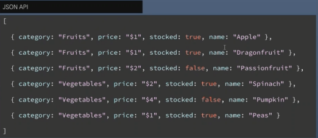

- 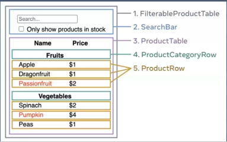

1. `FilterableProdjuctTable` : 예시 전체를 포괄
2. `SearchBar` : 사용자의 입력을 받습니다.

3. `ProductTable` : 데이터 리스트를 보여주고, 사용자의 입력을 기반으로 필터링
4. `ProductCategoryRow` : 각 카테고리의 헤더를 보여줌.
5. `ProductRow` : 각각의 제품에 해당하는 행을 보여줌

- 이 헤더가 복잡해지면 `ProductTableHeader` 컴포넌트를 만드는 것이 더 합리적일 것.

### Step2: React로 정적인 버전 구현하기

- 가장 쉬운 접근 방법은 상호작용 기능을 추가하지 않고, 데이터
  모델로부터 `UI`를 렌더링 하는 버전을 만드는 것

- 대체로 먼저 정적인 버전을 만들고 상호작용기능을 추가하는게 더 쉬움
- 정적 버전을만드는 것은 타이핑이 많이 필요하지만, 생각할 것이 적음
- 반대로 상호작용기능은 많은 생각이 필요하지만, 타이핑은 그리 많이 필요하지않음.
- 데이터 모델을 렌더링 하는 앱의 정적인 버전을 만들기 위해서는
  다른 컴포넌트를 재사용하고 `props`를 이용하여 데이터를 넘겨주는 컴포넌트를 구현하는 것이 좋음.
- 혹시 `State` 개념에 익숙하다고 해도 정적인 버전을 만드는 데는 `state`를 쓰지 않는다.
- `state`는 오직 상호작용을 위해, 즉 시간이 지남에 따라 데이터가 바뀌는 것에 사용합니다.
- 우리는 앱의 정적 버전을 만들고 있기 때문에 지금은 필요하지 않습니다.
- 앱을 만들때 계층 구조에 따라 상층부에 있는 컴포넌트 `FilterableProductTable` 부터 시작하는 하향식으로 만드는 방법이 있습니다.
- 또한 하층부에 있는 컴포넌트인 `ProductRow` 부터 상향식으로 만들 수도 있습니다.
- 간단한 예시에서는 보통 하향식으로 만드는 게 쉽지만, 프로젝트가 커지면 상향식으로 만들고 테스트를 작성하면서 개발하기가 더 쉬움

1. Project를 생성

- 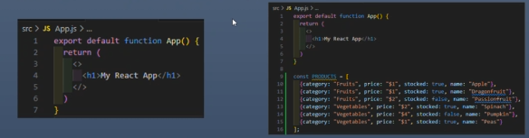

2. src 아래 필요없는 파일 제거 `logo.svg`/`setupTest.js`
3. App.js에 있는 코드를 모두 삭제합니다.
4. 먼저 다음 코드로 App.js가 정상적으로 동작하는지 확인
5. 사용할 데이터 `PRODUCTS`를 적당한 위치에 작성
6. `FilterableProductTable` `component` 만듬.

   ```javascript
   import logo from "./logo.svg";
   import "./App.css";

   export default function App() {
     return (
       <>
         <h1>My React App</h1>
       </>
     );
   }

   const PRODUCTS = [
     { category: "Fruits", price: "$1", stocked: true, name: "Apple" },
     { category: "Fruits", price: "$1", stocked: true, name: "Dragonfruit" },
     { category: "Fruits", price: "$2", stocked: false, name: "Passionfruit" },
     { category: "Vegetables", price: "$2", stocked: true, name: "Spinach" },
     { category: "Vegetables", price: "$4", stocked: false, name: "Pumpkin" },
     { category: "Vegetables", price: "$1", stocked: true, name: "Peas" },
   ];
   ```

### Step 3:최소한의 데이터만 이용해서 완벽하게 UI State 표현하기

- UI를 상호작용 하게 만들려면, 사용자가 기반 데이터 모델을 변경할 수 있게 해야합니다.

- `React`는 `state`를 통해 기반 데이터 모델을 변경할 수 있게 합니다.
- `state`는 앱이 기억해야 하는, 변경할 수 있는 데이터의 최소 집합이라고 생각
- `state`는 앱이 기억해야 하는, 변경할 수 있는 데이터의 최소 집합
- `state` 를 구조화하는데 가장 중요한 원칙은 중복배제 원칙
- 애플리케이션이 필요로 하는 가장 최소한의 `state`를 파악하고, 나머지 모든 것들은 필요에 따라 실시간으로 계산
- 예를 들어, 쇼핑 리스트를 만든다고 하면 배열에 상품아이템들을 넣을 것.
- UI에 상품 아이템의 개수를 노출하고 싶다면, 상품 아이템 개수를 따로 `state`값으로 가지는 게 아니라 단순하게 배열의 길이만 쓰면 됨.
- 예시 애플리케이션 내 데이터들을 생각. 다음과 같은 데이터를 가지고 있음

  1. 제품의 원본목록

  2. 사용자가 입력한 검색어
  3. 체크박스의 값
  4. 필터링된 제품 목록

- 이 중 어떤것이 `state`가 되어야 할까?
  1. 시간이 지나도 변하지 않나요? `state`아님
  2. 부모로부터 `props`로 전달됩니까? `state` 아님.
  3. 컴포넌트안의 다른 `state`나 `props`를 가지고 계산 가능한가요? 그렇다면 절대로 `state`가 아님.
- 이 외 남는 건 아마 `state`일 것임.

## 중간고사로 인한 공백(9주차)

- 중간고사

## 4월18일(8주차)

오늘 배운 내용

### 한 번 더 state 끌어올리기

- `xIsNext`,`currentSquares`,`handlePlay를` `Board` 컴포넌트에 `props`로 전달
- `Board` 컴포넌트가 `props`에 의해 완전히 제어되도록 만들겠습니다.

11. `Board`가 `xIsNext`,`squares`,`onPlay` 함수를 `props`로 받을 수 있도록 함
12. useState 호출하는 처음 두줄을 제거함

13. 이제 Board 컴포넌트의 `handleClick`에 있는 `setSqaures` 및 `setIsNext` 호출을 새로운 `onPlay` 함수에 대한 단일 호출로 대체함

- 게임이 다시 작동하려면 `handlePlay`를 구현해야 함

- 이제는 업데이트된 `squares` 배열을 `onPlay`로 전달
- `handlePlay`함수는 더이상 호출할수 있는 `setSquares` 함수가 없음
- 대신 이 정보를 저장하기 위해`history` `state`변수를 사용하고있음
- 업데이트된 `suqares` 배열을 새 히스토리 항목으로 추가하여 `history`를 업데이트 해야 하고 board에서 했던 것처럼 xIsNext 값을 반전시켜야 함
- 앞에서 `[...history, nextSquares]`는 `history`에 있는 모든 항목을 포함하는 새배열을 만들고 그 뒤에 `nextSquares`를 만듭니다.
- ...`history` 전개구문을 사용해 `history`의 모든 항목 열거로 읽을 수 있습니다.
- 예를 들어, `history`가 `[[null,null,null], ["X",null,null]]`이고 nextSquares 가 `["X",null,"O"]`라면 새로운 `[...history, nextSquares]` 배열은 `[[null,null,null], ["X",null,null], ["X",null,"O"]]`가 될 것입니다.
- 이 시점에서 `state`를 `Game` 컴포넌트로 옮겼으므로 리팩토링 전과 마찬가지로 UI가 완전히 작동해야 합니다. 이 시점에서 코드의 모습은 다음과 같습니다.

  ```javascript
  import { useState } from "react";
  function Square({ value, onSquareClick }) {
    return (
      <button className="square" onClick={onSquareClick}>
        {value}
      </button>
    );
  }

  function Board({ xIsNext, squares, onPlay }) {
    function handleClick(i) {
      if (calculateWinner(squares) || squares[i]) {
        return;
      }
      const nextSquares = squares.slice();
      if (xIsNext) {
        nextSquares[i] = "X";
      } else {
        nextSquares[i] = "O";
      }
      onPlay(nextSquares);
    }

    const winner = calculateWinner(squares);
    let status;
    if (winner) {
      status = "Winner: " + winner;
    } else {
      status = "Next player: " + (xIsNext ? "X" : "O");
    }

    return (
      <>
        <div className="status">{status}</div>
        <div className="board-row">
          <Square value={squares[0]} onSquareClick={() => handleClick(0)} />
          <Square value={squares[1]} onSquareClick={() => handleClick(1)} />
          <Square value={squares[2]} onSquareClick={() => handleClick(2)} />
        </div>
        <div className="board-row">
          <Square value={squares[3]} onSquareClick={() => handleClick(3)} />
          <Square value={squares[4]} onSquareClick={() => handleClick(4)} />
          <Square value={squares[5]} onSquareClick={() => handleClick(5)} />
        </div>
        <div className="board-row">
          <Square value={squares[6]} onSquareClick={() => handleClick(6)} />
          <Square value={squares[7]} onSquareClick={() => handleClick(7)} />
          <Square value={squares[8]} onSquareClick={() => handleClick(8)} />
        </div>
      </>
    );
  }

  export default function Game() {
    const [xIsNext, setXIsNext] = useState(true);
    const [history, setHistory] = useState([Array(9).fill(null)]);
    const currentSquares = history[history.length - 1];

    function handlePlay(nextSquares) {
      setHistory([...history, nextSquares]);
      setXIsNext(!xIsNext);
    }

    return (
      <div className="game">
        <div className="game-board">
          <Board xIsNext={xIsNext} squares={currentSquares} onPlay={handlePlay} />
        </div>
        <div className="game-info">
          <ol>{/*TODO*/}</ol>
        </div>
      </div>
    );
  }

  function calculateWinner(squares) {
    const lines = [
      [0, 1, 2],
      [3, 4, 5],
      [6, 7, 8],
      [0, 3, 6],
      [1, 4, 7],
      [2, 5, 8],
      [0, 4, 8],
      [2, 4, 6],
    ];
    for (let i = 0; i < lines.length; i++) {
      const [a, b, c] = lines[i];
      if (squares[a] && squares[a] === squares[b] && squares[a] === squares[c]) {
        return squares[a];
      }
    }
    return null;
  }
  ```

### 화면이 한 줄로 깨져서 보이는 이유

- `<button>` 을 div 로 감싸서 생기는 문제

- react fragment(<>...</>)로 감싸거나 `<button>` 만 남겨주세요.
- react fragment를 사용하면 구조도 깔끔하고 유지보수도 편함.

### 과거 움직임 보여주기

- 이제 틱택토 게임의 히스토리를 기록하므로, 플레이어에게 과거 이동 목록을 보여줄 수 있습니다.

- `<button>` 과 같은 React 엘리먼트는 일반 JavaScript 객체이므로 애플리케이션에서 전달할 수 있습니다.
- React에서 여러 엘리먼트를 렌더링하려면 React 엘리먼트 배열을 사용할 수 있습니다.
- 이미 state에 이동 history 배열이 있으므로 이를 React 엘리먼트 배열로 변환해야 합니다.
- JavaScript에서 한 배열을 다른 배열로 변환하려면 배열 map 메서드를 사용하면 됩니다.
  ```javascript
  [1, 2, 3].map((x) => x * 2); // [2, 4, 6]
  ```

1. 플레이 history 배열을 화면의 버튼을 나타내는 React 엘리먼트로 변환합니다.

2. 과거의 플레이로 "점프" 할 수 있는 버튼목록을 표시하세요
3. 이것을 구현하기위해 Game 컴포넌트에서 history를 map을 이용해보겠습니다.

### map 함수의 활용

- 문서의 내용이 어렵게 되어있기 때문에 다시 정리합니다.
  ```javascript
  const moves = history.map((squares, move) => {});
  ```
- map의 기본 구문은 map(callbackFn)혹은 map(callbackFn, thisArg)입니다.

- thisArg는 내부에서 this로 사용할 값을 지정하는데 화살표 함수에서는 생략됩니다.
- 따라서 예제에서는 callbackFn만 사용하고, 화살표 함수가 callback함수를 대신합니다.
- squares, move 는 화살표 함수의 매개변수입니다.

1. history.map: history는 모든 플레이를 저장하는 배열입니다. 이 history에 map 함수를 적용한다는 의미입니다.
2. map함수는 history 각각의 요소 index를 순회하면서 squares 추출합니다.
3. 각 요소는 {} 안의 실행문을 실행하면서 버튼을 생성합니다.
4. 이렇게 생성된 버튼은 moves 객체(배열)에 다시 저장됩니다.
5. move는 최종 rendering에 사용됩니다.

- 다시 정리하면

  - 원본배열(history):map이 호출된 원본 배열.

  - 원본 배열의 인덱스 (move): 현재 순환중인 원본 배열 요소의 인덱스.
  - 요소 값(squares): 현재 순회 중인 요소 배열의 값.

- history.map((squares,move)=>{ ... })는 다음과 같이 동작합니다.

  - 첫번째 호출 : `squares = [null,null,null,null,null,null,null,null,null], move = 0`

  - 두번째 호출 : `squares =['x',null,null,null,null,null,null,null,null], move = 0`
  - 세번째 호출 : `squares = ['x','o',null,null,null,null,null,null,null], move = 0`

- 각각의 history 요소에 대한 {}의 실행문(후작업) 실행합니다.

- moves 객체에 저장합니다.
- 최종 출력에 사용합니다.

### KEY 선택하기

- 리스트를 렌더링할 때 React는 렌더링 된 각 리스트 항목에 대한 몇 가지 정보를 저장합니다.

- 리스트를 업데이트 할 때 React는 무엇이 변경되었는지 확인해야합니다.
- 리스트의 항목은 추가,제거,재정렬 또는 업데이트 될 수 있습니다. -리스트가 다음과 같이 업데이트가 되었다고 생각해 봅니다.
- 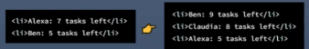
- 아마 task의 개수가 업데이트 되었을 뿐만 아니라 Alexa 와 Ben의 순서가 바뀌고 Claudia가 두 사람 사이에 추가되었다고 생각할 것입니다.
- 그러나 React는 컴퓨터 프로그램이므로 우리가 의도한 바가 무엇인지 알지 못합니다.
- 그러므로 리스트의 항목에 key 프로퍼티를 지정하여 각 리스트의 항목이 다른 항목과 다르다는 것을 구별해 주어야 합니다.
- 만약 데이터베이스에서 불러온다면 데이터베이스 ID를 key로 사용할 수 있습니다.
- 
- 리스트가 다시 렌더링되면 React는 각 리스트 항목의 key를 가져와서 이전 리스트의 항목에서 일치하는 key를 탐색합니다.
- 현재 리스트에서 이전에 존재하지 않았던 key가 있으면 React는 컴포넌트를 생성합니다.
- 만약 현재리스트에서 이전리스트가 존재했던 key를 가지고 있지 않다면 React는 그 key를 가진 컴포넌트를 제거합니다.
- 두 key가 일치한다면 해당 컴포넌트는 이동합니다.ㅣ
- key는 각 React가 각컴포넌트를 구별할수있게 합니다.
- key는 React에서 특별하게 미리 지정된 프로퍼티입니다.
- 엘리먼트가 생성되면 React는 key프로퍼티를 추출하여 반환되는 엘리먼트에 직접 key를 저장합니다.
- key가 props로 전달되는것처럼 보일 수 있지만 react는 자동으로 key를 사용해 업데이트할 컴포넌트를 결정합니다.
- 부모가 지정한 key가 무엇인지 컴포넌트는 알 수 없습니다.
- 동적인 리스트를 만들때마다 key를 할당할 것을 추천합니다.
- 적절한 key가 없는경우 데이터의 재구성을 고려해보세요
- key가 지정되지않은 경우 React는 경고를 표시하면 배열의 인덱스를 기본 key로 사용합니다.
- 배열인덱스를 key로 사용하면 항목의 순서를 바꾸거나 항목을 추가/제거할때 문제가 발생합니다.
- 명시적으로 key={i}를 전달하면 경고는 사라지지만 문제가 발생하므로 대부분은 추천하지 않습니다.

### 시간여행 구현하기 -1

- 틱택토 게임의 기록에서 과거의 각 플레이어는 해당 플레이의 일련번호인 고유ID가 있습니다.

- 플레이는 중간에 순서를 바꾸거나 삭제하거나 삽입할 수 없기 때문에 인덱스를 key로 사용하는 것이 안전합니다.

1. Game함수에서 `<li key={move}>`로 key를 추가할 수 있으며, 렌더링 된 게임을 다시 로드하면 React의 "key"에러가 사라질 것입니다.

### 시간여행 구현하기 -2

- `jumpto` 를 구현하기 전에 사용자가 현재 어떤 단계를 보고잇는지 추적할 `Game` 컴포넌트의 `state` 가 하나 더 필요합니다.

1. 이를 위해 기본값이 0인 `currentMove` 라는 새 `state` 변수를 정의하세요.

   ```javascript
   export default function Game() {
     const [xIsNext, setXIsNext] = useState(true);
     const [history, setHistory] = useState([Array(9).fill(null)]);
     const [currentMove, setCurrentMove] = useState(0);
     const currentSquares = history[history.length - 1];
     //...
   }
   ```

2. 다음으로 `Game` 내부의 `jumpTo` 함수를 업데이트하여 해당 `currentMove`를 업데이트하세요
3. 또한 `currentMove`를 변경하는 숫자가 짝수면 `xIsNext`를 `true`로 설정하세요.

- 이제 사각형을 클릭할 때 호출되는 `Game`의 `handlePlay` 함수 내용을 두 가지 변경하겠습니다.

4. 시간을 거슬러 올라가서” 그 시점에서 새로운 이동을 하는 경우 해당 시점까지의 히스토리만 유지해야 합니다. `history`의 모든 항목(... 전개 구문) 뒤에 `nextSquares`를 추가하는 대신 `history.slice(0, currentMove + 1)`의 모든 항목 뒤에 추가하여 이전 히스토리의 해당 부분만 유지하도록 하겠습니다.

5. 이동할 때마다 최신 히스토리 항목을 가리키도록 `currentMove`를 업데이트하세요.
   ```javascript
   function handlePlay(nextSquares) {
     const nextHistory = [...history.slice(0, currentMove + 1), nextSquares];
     setHistory(nextHistory);
     setCurrentMove(nextHistory.length - 1);
     setXIsNext(!xIsNext);
   }
   ```
6. 마지막으로 항상 마지막 동작을 렌더링하는 대신 현재 선택한 동작을 렌더링하도록 Game 컴포넌트를 수정하겠습니다.
   [history.length -1 ]-> [currentMove]

### 최종 정리

- 코드를 자세히 살펴보면 `currentMove`가 짝수일 때는 `xIsNext === true` 가 되고 , `currentMove`가 홀수일 때는 `xIsNext = false`가 되는 것을 알 수 있습니다.

- 즉 , `currentMove`의 값을 알고 있다면 언제나 `xIsNext`가 무엇인지 알아낼 수 있습니다.
- 따라서 이 두가지 state를 모두 저장할 이유가 없습니다.
- 항상 중복되는 state는 피하세요.
- state에 저장하는 것을 단순화하려면 버그를 줄이고 코드를 더 쉽게 이해할 수 있습니다.
- `Game`을 변경하여 더이상 `xIsNext`를 별도의 state변수로 저장하지 않고 `currentMove`를 기반으로 알아내도록 수정하겠습니다.

- 더 이상 `xIsNext` state 선언이나 `setXIsNext` 호출이 필요하지 않습니다.

- 이제 컴포넌트를 코딩하는 동안 실수를 하더라도 `xIsNext`가 `currentMove`와 동기화되지 않을 가능성이 없습니다.

### 향후 과제

- 시간이 남거나 새로운 React 기술을 연습하고 싶다면 아래에 틱택토 게임을 개선할 수 있는 몇 가지 아이디어가 있습니다. 아이디어는 난이도가 낮은 순으로 정렬되어 있습니다.

1. 현재 이동에 대해서만 버튼 대신 “당신은 #번째 순서에 있습니다…”를 표시해 보세요.

2. `Board`를 하드 코딩 하는 대신 두 개의 루프를 사용하여 사각형을 만들도록 다시 작성해 보세요.
3. 동작을 오름차순 또는 내림차순으로 정렬할 수 있는 토글 버튼을 추가해 보세요.
4. 누군가 승리하면 승리의 원인이 된 세 개의 사각형을 강조 표시해 보세요. (아무도 승리하지 않으면 무승부라는 메시지를 표시하세요. )
5. 이동 히스토리 목록에서 각 이동의 위치를 형식(열, 행)으로 표시해 보세요.

## 4월17일(7주차)

오늘 배운 내용

### state 끌어올리기

- handleClick 함수는 javascript의 slice() 배열 메서드를 사용하여 squares 배열의 사본인 nextSquares를 생성

- 그 다음 handleClick 함수는 nextSquares 배열의 첫 번째 Squares(index [0])에 X를 추가하여 업데이트
- setSquares 함수를 호출하면 React는 컴포넌트의 state가 변경되었음을 알 수 있음.
- 그러면 squares를 사용하는 컴포넌트 Board와 그 하위컴포넌트 Square 컴포넌트가 다시 렌더링 됨.ㅣ
- javascript는 클로저를 지원하기 때문에 내부 함수가 (예:handleClick) 외부 함수 (예:Board) 에 정의된 변수 및 함수에 접근
- handleClick 함수는 squares의 state를 읽고 setSqaures 메서드를 호출할 수 있는데, 이 두 함수는 Board 함수 내부에 정의되어 있기 때문
- 다음으로 인수 i를 handleClick에 전달
- Square의 onSqareClick prop를 아래와 같이 직접 handleClick(0)으로 설정할수도있지만 작동하지 않음
- 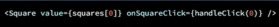
- handleClick(0) 호출은 Board컴포넌트 렌더링의 일부가 됨
- handleClick(0)은 setSquares를 호출하여, Board 컴포넌트의 state를 변경하기 때문에 Board 컴포넌트 전체가 다시 렌더링됨
- 이과정에서 함수가 다시 실행되기 때문에 무한루프에 빠지게 됨.
- 하지만 9개의 서로다른함수를 정의하고 각각 이름붙이는건 너무 복잡함.
- 대신 이렇게 함
- 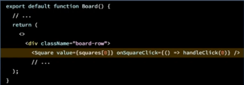
- 새로운 문법 ()=>{}
- ()=>{handleClick(0)}은 화살표 함수로 , 함수를 짧게 정의하는 방법
- Square가 클릭 되면 => "화살표" 뒤의 코드가 실행되어 handleClick(0)을 호출함
- handleClick(0) 함수를 화살표 함수가 호출하고, 화살표 함수를 square에 전달함.

  ```javascript
  import { useState } from "react";
  import Square from "./Sqare";

  export default function Board() {
    const [squares, setSquares] = useState(Array(9).fill(null));
    function handleClick(i) {
      const nextSquares = squares.slice();
      nextSquares[i] = "x";
      setSquares(nextSquares);
    }
    return (
      <div>
        <div className="board-row">
          <Square
            value={squares[0]}
            onSquareClick={() => {
              handleClick(0);
            }}
          ></Square>
          <Square
            value={squares[1]}
            onSquareClick={() => {
              handleClick(1);
            }}
          ></Square>
          <Square
            value={squares[2]}
            onSquareClick={() => {
              handleClick(2);
            }}
          ></Square>
        </div>
        <div className="board-row">
          <Square
            value={squares[3]}
            onSquareClick={() => {
              handleClick(3);
            }}
          ></Square>
          <Square
            value={squares[4]}
            onSquareClick={() => {
              handleClick(4);
            }}
          ></Square>
          <Square
            value={squares[5]}
            onSquareClick={() => {
              handleClick(5);
            }}
          ></Square>
        </div>
        <div className="board-row">
          <Square
            value={squares[6]}
            onSquareClick={() => {
              handleClick(6);
            }}
          ></Square>
          <Square
            value={squares[7]}
            onSquareClick={() => {
              handleClick(7);
            }}
          ></Square>
          <Square
            value={squares[8]}
            onSquareClick={() => {
              handleClick(8);
            }}
          ></Square>
        </div>
      </div>
    );
  }
  ```

- 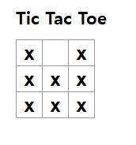

- 사용자가 왼쪽 위 사각형을 클릭시 어떤일이 일어나는지

  1. 왼쪽 위 사격형 클릭시 button이 square로부터 onclick prop으로 받은 함수가 실행됨

  - square 은 onSqareClick prop으로 받았음
  - board 컴포넌트는 jsx에서 해당 함수를 직접 정의함
  - 이 함수는 0을 인수로 handleClickk을 호출함

  2. handleClick은 인수0을 사용해 squares 배열의 첫 번째 엘리면트를 null에서 x로 업데이트
  3. board 컴포넌트의 squares state가 업데이트 되어 Board 와 그 모든 자식이 다시 렌더링 됨.
  4. 사용자는 왼쪽 위 클릭후 비어있던게 x로 바뀐것을 확인

- state 끌어올리기
- DOM <button> 엘리먼트의 onClick 어트리뷰터(속성)는 빌트인 컴포넌트이기 때문에 React에서 특별한 의미를 갖습니다.
- 사용자 정의 컴포넌트, 예를 들어 square의 경우 이름은 사용자가 원하는 대로 지을 수 있습니다.
- square의 onSquareClick prop 나 Board의 handleClick 함수에 어떠한 이름을 붙여도 코드는 동일하게 작동합니다.
- React에서는 주로 이벤트를 나타내는 prop에는 onSometing과 같은 이름을 사용하고, 이벤트를 처리하는 함수를 정의할때는 handleSomething과 같은 이름을 사용합니다.

### 불변성이 왜 중요할까요

- 최종 결과는 같지만 , 원본 데이터를 직접 변형하지 않음으로써 몇가지
  이점을 얻을 수 있습니다.

- 불변성을 사용하면 복잡한 기능을 훨씬 쉽게 구현할 수 있습니다.ㅣ
- "돌아가기"를 할 수 있는 "시간 여행" 기능을 구현할 예정입니다.
- 특정 작업을 실행 취소하고 다시 실행하는 기능은 앱의 일반적인 요구사항임.
- 직접적인 데이터 변경을 피하면 이전버전의 데이터를 그대로 유지하여 나중에 재사용 할 수 있음.
- 불변성의 사용하는 것의 또다른 장점
- 기본적으로 부모 컴포넌트의 state가 변경되면 모든 자식 컴포넌트가 자동으로 다시렌더링 됨.
- 여기에는 변경 사항이 없는 자식컴포넌트도 포함됩니다.
- 리렌더링 자체가 사용자에게 보이는 것은 아니지만 성능상의 이유로 트리의 영향을 받지 않는 부분의 리렌더링을 피하는 것이 좋음.
- 불변성을 사용하면 컴포넌트가 데이터의 변경 여부를 저렴한 비용으로 판단할 수 있음.

### 교대로 두기 - 1

- 현재까지 작성한 틱택토게임에서 가장 큰 결함인 0을 보드에 표시할 수 없다는 문제를 수정할 차례

  1. 첫번째 선수가 두는 말을 "X"로 설정합니다. 이제 Board 컴포넌트에 또 다른 State를 추가하여 추적해 보겠습니다.

  - X와 0가 번갈아 한 번씩 두어야 하기 때문에 X가 두었는지 아닌지 현재의 상태를 보관하면 됩니다. 즉 x의 차례면 true,0의 차례면 false 상태로 기억하면 됩니다.

  2. 플레이어가 움직일 때마다 다음 플레이어를 결정하기 위해 불리언 값이 isNext가 반전됨니다.

  - 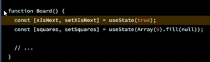

- 완성된 코드
- 

### 교대로 두기 - 2

- ox가 덮어씌워지는 경우가 생기기 때문에 return을 해줌.

  ```javascript
  const [xIsNext, setXIsNext] = useState(true);
  const [squares, setSquares] = useState(Array(9).fill(null));

  function handleClick(i) {
    if (squares[i]) {
      return;
    }
    const nextSquares = squares.slice();
    if (xIsNext) {
      nextSquares[i] = "X";
    } else {
      nextSquares[i] = "O";
    }
    setSquares(nextSquares);
    setXIsNext(!xIsNext);
  }
  ```

### 승자 결정하기

1. 먼저 승리할 수 있는 경우의 자리를 2차원 배열로 선언합니다.

2. 선언된 배열 line과 squares를 비교하기 위한 for 문을 작성합니다.
3. 비교를 위해 구조 분해 할당을 합니다.

```javascript
export default function Board() {
  //...
}

function calculateWinner(squares) {
  const lines = [
    [0, 1, 2],
    [3, 4, 5],
    [6, 7, 8],
    [0, 3, 6],
    [1, 4, 7],
    [2, 5, 8],
    [0, 4, 8],
    [2, 4, 6],
  ];
  for (let i = 0; i < lines.length; i++) {
    const [a, b, c] = lines[i];
    if (squares[a] && squares[a] === squares[b] && squares[a] === squares[c]) {
      return squares[a];
    }
  }
  return null;
}
```

### 구조 분해 할당

- 비구조화 할당, 구조화 할당이라고도 번역되지만 구조분해할당을 많이 사용합니다.

- 배열이나 객체의 구조를 해체하여 내부 값을 개별 변수에 쉽게 할당하는 방법입니다.
- 이를 통해 코드의 간결성과 가독성을 높일 수 있습니다.
- map함수에서도 사용되는 아주 많이 사용하는 방법입니다.
- 구화 분해 활당은 배열이나 객체의 구조를 해체하여 내부 값을 개별 변수에 쉽게 할당하는 방법
- 코드의 간결성과 가독성을 높일 수 있음.
- lines는 승리 할 수 있는 squares 의 index 번호입니다.
- for문을 통해 lines의 길이 만큼 비교를 반복합니다.
- 구조 분해 할당을 통해 lines의 index를 a,b,c에 보관합니다.
- squares의 해당 index값을 비교하여 3개가 모두 일치하면 값이 x인지 0인지를 return 합니다.

### 승자 결정하기 - 2

7. 게임이 끝났을때 플레이어에게 알리기 위해 "winner:x" 또는 "winnder:o" 라고 표시하겠습니다.
8. 이렇게 하려면 board 컴포넌트에 status구역을 추가하면 됩니다.
9. 게임이 끝나면 status는 승자를 표시하고, 게임이 진행 중인 경우 다음 플레이어의 차례를 표시합니다.

   ```javascript
     export default function Board() {
     // ...
       const winner = calculateWinner(squares);
       let status;
       if (winner) {
         status = "Winner: " + winner;
       } else {
         status = "Next player: " + (xIsNext ? "X" : "O");
       }

       return (
         <>
           <div className="status">{status}</div>
           <div className="board-row">
             // ...
       )
     }
   ```

### 시간여행 추가하기

- 마지막 연습으로 게임의 이전 동작으로 "시간을 거슬러 올라가는" 기능
- [ 플레이 히스토리 저장하기 ]
  - squares 배열을 직접 업데이트 하면 시간 여행을 구현하기는 매우 어려울 것입니다.
  - 하지만 우리는 slice를 사용하여 플레이어가 클릭할때마다 squares 배열의 새 복사본을 만들고 이를 불변으로 처리했습니다.
  - 덕분에 squares 배열의 모든 과거 버전을 저장할 수 있고, 이미 발생한 플레이의 내용을 탐색할 수 있습니다.
  - 과거의 squares 배열을 history라는 다른 배열에 저장하고, 이배열을 새로운 state변수로 저장하겠습니다.
  - history 배열은 첫 번째 플레이부터 마지막 플레이까지 모든 보드 state를 나타냅니다.
    ```javascript
    [
      // Before first move
      [null, null, null, null, null, null, null, null, null],
      // After first move
      [null, null, null, null, "X", null, null, null, null],
      // After second move
      [null, null, null, null, "X", null, null, null, "O"],
      // ...
    ];
    ```

### 한 번 더 STATE 끌어올리기

1. 먼저 export default가 있는 game 컴포넌트 추가
2. 마크업 안에 board 컴포넌트 렌더링
3. export default 컴포넌트는 하나의 컴포넌트 파일 안에 하나만 존재해야 하므로 Board에서는 삭제
4. 이것은 index.js 파일에서 Board 컴포넌트 대신 Game 컴포넌트를 최상위 컴포넌트로 사용하도록 지시합니다.
5. Game 컴포넌트가 반환하는 내용에 추가한 div는 나중에 보드에 추가할 게임정보를 위한 공간을 확보합니다.

## 4월10일(6주차)

오늘 배운 내용

### props를 통해 데이터 전달하기

- 재사용할 수 있는 component 만들기

- Board component를 만들고 square component의 내용을 복사
- square component의 button을 하나만 남기고 모두 삭제
- board component의 button을 square component로 교체합니다.
- App에서 호출하는 component를 square에서 Board로 바꿔줍니다.
- 여기까지 하면 component는 깔끔하게 정리됐지만 , 숫자 출력이 1만 나오게 됩니다.
- 이 문제를 해결하기위해 props를 사용하여 각 사각형이 가져야 할 값을 부모에서 자식으로 전달하겠습니다.
- square component를 value prop을 전달 받을 수 있도록 수정합니다.
  ```javascript
  function square({ value }) {
    return <button className="square">1</button>;
  }
  ```
- javascript 변수가 렌더링 되어야 합니다.
- javascript로 탈출 하려면 중괄호가 필요합니다. JSX에서 value 주위에 중괄호를 추가합니다
  ```javascript
  function square({ value }) {
    return <button className="square">{value}</button>;
  }
  ```

### 사용자와 상호작용하는 컴포넌트 만들기

- Square 컴포넌트를 클릭하면 x로 채워지게 코드수정

- 먼저 Square 내부에 handleClick 함수를 선언
- JSX 버튼의 props에 onClick을 추가
- 사각형 클릭시 탭에 clicked 라는 로그가 표시됨.
- 다음으로 사각형 컴포넌트가 클릭된 것을 기억 하고 X 표시로 채워보겠습니다.
- 컴포넌트는 무언가 기억하기위해 state를 사용합니다.
- react는 상태기억을 위해 useState라는 Hook을 제공합니다.
- square의 현재 값을 state에 저장 하고 square가 클릭하면 값이 변경되도록 하겠습니다.
- 파일 상단에서 useState를 import 합니다.
- Square 컴포넌트에서 value prop 을 제거합니다. 대신 useState를 사용합니다.
- Square 컴포넌트의 시작 부분에 useState를 호출하고, value라는 이름의 state변수를
  반환하도록 하세요.
  ```javascript
      import {useState} from 'react'
      function Square(){
        const [value,setValue]=useState(null);
        ...
      }
  ```
- value는 값을 저장하는 변수,setValue는 값을 변경하는 데 사용하는 함수입니다.
- useState에 전달된 null은 이 state변수의 초기값입니다.
- 앞에서 Square 컴포넌트는 더이상 props를 사용하지 않게 수정
- 따라서 Board 컴포넌트가 생성한 9개의 컴포넌트에서 value prop을 제거합니다.
- 

### state 끌어올리기

- 현재 각 Square 컴포넌트는 게임 state의 일부를 기억합니다.

- 틱택토 게임에서 승자를 확인하려면 Board가 9개의 Square 컴포넌트 각각의 state를 기억
- Board가 각각의 Square에 state를 요청하는것은 기술적으로는 가능하지만,
  코드가 이해하기 어렵고 버그에 취약하며 리팩토링하기 어렵기 때문에 권장하지 않습니다.
- 가장 좋은 방법은 게임의 state를 각 Square가 가아닌 부모 컴포넌트인 Board 에 저장하는 것입니다.
- 숫자를 전달햇을때와 같이 prop를 전달하여 각 Square에 표시할 내용을 정할 수 있습니다.
- 여러 자식 컴포넌트에서 데이터를 수집하거나 두자식 컴포넌트가 서로 통신하도록 하려면, 부모 컴포넌트에서 공유 state를 선언해야 합니다.
- 부모 컴포넌트는 props를 통해 해당 state를 자식 컴포넌트에 전달할 수 있습니다.
- 이렇게하면 자식컴포넌트가 서로 동기화 되고, 부모 컴포넌트와도 동기화되도록 할 수 있습니다.
- 부모컴포넌트로 state를 끌어올리는 것은 많이 사용하는 방법입니다.
- Board 컴포넌트를 편집해서 9개 Square에 해당하는 9개의 null의 배열을 기본값으로 하는 state변수 squares 선언
  ```javascript
      const [squares,setSquares]-useState(Array(9).fill(null));
  ```
- 배열의 각 항목은 각 Square 컴포넌트의 값에 해당합니다.
- 보드를 채우면 squares 배열은 다음과 같은 모양이 됩니다.
  ```javascript
  ["o", null, "x", "o", null, "x", "o", null, "x"];
  ```

### component 분리하기

- Board component가 export default 로 선언된 것을 보면 component가 분리되었다는것을 알 수 있습니다.

- 우리는 모두 분리해서 만듬.
- [ 분리 순서 ]
  1. component이름과 동일한 파일을 만듭니다.
  2. 해당 파일에 코드를 복사하고 export default 키워드 추가
  3. 필요한 component와 useState를 추가
  4. App.js에서 해당 코드를 삭제하고, Board Component를 import 해줌
  5. App.js 에서 useState의 import를 제거합니다.
  6. 정상적으로 동작하는지 확인.

## 4월3일(5주차)

오늘 배운 내용

### 이벤트에 응답하기

- component 내부에 event handler 함수를 선언하면 event에 응답 할 수 있습니다.

- onClick ={handleClick}의 끝에 소괄호() 가 없는것을 주목
- 함수를 호출하지 않고 전달만
- 버튼을 클릭할때 이벤트 핸들러를 호출
- 만들어보기

  ```javascript
  import logo from "./logo.svg";
  import "./App.css";

  export default function MyButton() {
    function handleClick() {
      alert("You clicked me!");
    }
    return <button onClick={handleClick}>I'm My button component</button>;
  }
  ```

  ```javascript
  import { useState } from "react";
  import "./App.css";

  function Board() {
    return (
      <div>
        <div className="board-row">
          <Square></Square>
          <Square></Square>
          <Square></Square>
        </div>
        <div className="board-row">
          <Square></Square>
          <Square></Square>
          <Square></Square>
        </div>
        <div className="board-row">
          <Square></Square>
          <Square></Square>
          <Square></Square>
        </div>
      </div>
    );
  }

  function Square() {
    const [value, setValue] = useState(null);
    function handleClick() {
      setValue("X");
    }
    return (
      <div>
        <button className="square" onClick={handleClick}>
          {value}
        </button>
      </div>
    );
  }

  export default function App() {
    return (
      <div>
        <h1>Tic Tac Toe</h1>
        <Board></Board>
      </div>
    );
  }
  ```

### 화면 업데이트하기

- 특정 정보를 기억해 두었다가 표시

- 버튼이 클릭된 횟수
- component에 state를 추가
- useState를 import
- 이코드를 보면 useState는 react 파일 안에 named Exports로 선언되어있는 여러개의 component 중 하나
- 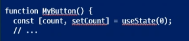
- 이제 comonent내부에 state 변수를 선언
- useState로부터 현재의 state를 저장할 수 있는 변수인 count와 이를 업데이트 할 수 있는 함수인 setCount를 얻을 수 있습니다.
- 이름은 자유롭게 지정할 수 있지만[someting,setSomething]으로 작성하는 것이 일반적.
- 변수 이름과 변수 이름 앞에 set을 붙인 업데이트 함수를 관용적으로 사용
- [실습]
  - 버튼이 처음 표시될 때는 useState()에 0을 전달했기때문에 count가 0이 됨.
  - state를 변경하고 싶다면 setCount()를 실행하고 새 값을 전달
  - 이 버튼을 클릭하면 카운터가 증가
  - 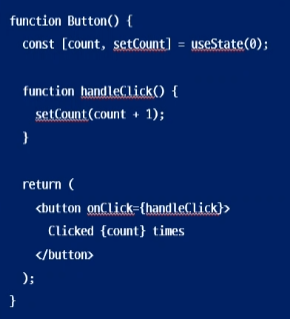

### Hook 사용하기

- use로 시작하는 함수를 Hook이라고 합니다.
- useState는 React에서 제공하는 내장 Hook입니다.
- 다른 내장 Hook은 API 참고서에서 찾아볼 수 있습니다.
- 또한 기존의 것들을 조합하여 자신만의 Hook을 작성할 수도 있습니다.
- Hook은 다른 함수보다 더 제한적입니다.
  예를 들면...
- component 또는 다른 Hook의 상단에서만 Hook을 호출
- 조건이나 반복문에서 useState를 사용하고 싶다면 새 컴포넌트를 추출하여 그곳에 넣으세요.

### Hook의 사용규칙

- React 함수형 component 또는 사용자 Hook 내부에서만 사용가능
- 일반적인 javascript 함수에서 useState,uesEffect 등의 Hook을 사용 할 수 없습니다.

```javascript
function notAComponent() {
  useState(0); // 일반 함수에서 Hook 사용 불가
}
```

```javascript
const [count, setCount] = useState(0); // react 함수 컴포넌트에서 사용가능
```

### function component vs class component

- 왜 요즘은 function형 component를 주로 사용할까

- 인터넷 찾다보면 class가 많이 나옴
- React의 역사
  - react 초창기 ( 2013~2014 )
    - 함수형 컴포넌트는 존재했지만 단순히 props를 받아 UI 반환하는 역할만 가능
    - 상태나 생명주기기능이 없었음
    - 그래서 주로 class형으로 사용함
  - React 16.8 (2019) -> Hooks 도입
    - useState,uesEffect 등의 Hook이 추가되면서 , 함수형 component에서도 상태관리 생명주기 기능을 구현할 수 있게 됨.
    - 이후 React 공식 문서에서도 함수형 컴포넌트와 hook 사용을 권장하게 됨

### component 간 데이터 공유

- 공식문서에서는 MyButton과 MyApp을 계속 수정해가면서 설명중이라 이전 상태 확인이 어려움.

- 물론 변경이 있을 때마다 꼼꼼히 commit을 해두면 checkout을 통해서 확인이 가능
- 다만 이경우 checkout을 반복해야하기 때문에 확인하는데 불편
- 따라서 실습은 별도의 component 만들어 사용
- 하지만 데이터를 공유하고 항상 함께 업데이트 하기 위한 component가 필요한 경우가 많습니다.
- 두개의 CountState2 component가 동일한 countd를 표시하고 함께 업데이트 하려면
  state를 개별 버튼에서 모든 버튼이 포함된 가장 가까운 component 안으로 이동해야 합니다.
- 여기서 이야기하는 제일 가까운 component는 App component입니다.
- 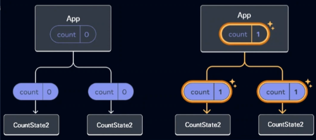
- 두 버튼중 하나를 클릭하면 App의 count가 변경되어 ,CountState2의 count가 모두변경되게 해보도록 하겠습니다. -먼저 App 안으로 useState를 이동하고, CountState2를 2개 이상 rendering 합니다.
- 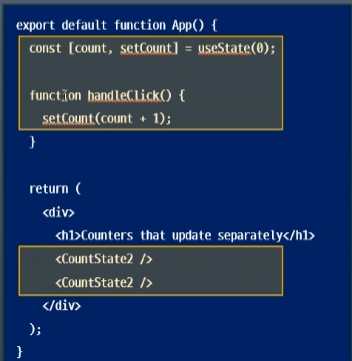
- 다음으로 공유된 click handler와 count를 각 CountState2로 전달합니다.
- JSX 중괄호를 사용하여 CountState2에 정보를 전달 할 수 있습니다.
- 이렇게 component에 전달하는 정보를 props라고 합니다.
- 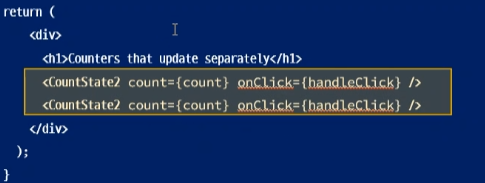
- 마지막으로 parent component인 App에서 전달한 props를 읽을 수 있도록 CounterState component를 변경합니다.
- 동작 과정
  1. 버튼을 클리갛면 onClick 핸들러가 실행됨 왜냐면 각 버튼의 onClick prop은 App 내부의 handleClick 함수로 설정되어 있기 때문입니다.
  2. 이 코드는 setCount(count+1)을 실행시켜 countState변수를 증가시킵니다.
  3. 새로운 count 값은 각 버튼에 prop로 전달되기 때문에 모든 번튼에는 새로운 값이
     표시됩니다.
  4. 이것을 state 끌어올리기 라고 합니다.
  5. state를 위로 이동함으로써 컴포넌트 간에 State를 공유하게 됩니다.

## 3월27일(4주차)

오늘 배운 내용

- component는 고유한 로직과 모양을 가진 UI의 일부입니다.

- component는 버튼처럼 작을 수도 있고 전체페이지처럼 클 수도 있음
- component는 마크업을 반환 하는 javascript 함수
- nesting은 css 선택자의 중첩 구조를 생각한다.
- react 구동
  ```javascript
  npm start
  ```
- 컴포넌트 중첩

  ```javascript
  import logo from "./logo.svg";
  import "./App.css";

  function MyButton() {
    return <button>I'm My button component</button>;
  }

  export default function App() {
    return (
      <div>
        <h1>Hello React</h1>
        <MyButton></MyButton>
      </div>
    );
  }
  ```

- export default 키워드는 기본 component 지정

- JavaScript 문법임
- Named Exports
  - 하나의 파일안에 여러개의 component가 있을 때 사용
  - component 사용하는 쪽에서는 component 정확한 이름을 반드시 명시
- Default Exports
  - 하나의 파일안에서 하나의 component만 내보내는 경우 사용
  - 사용하는 쪽에서는 어떤 이름을 사용해도 상관없음.
- export 와 import
  ```javascript
  export default function MyButton() {
    return <button>I'm My button component</button>;
  }
  import MyButton from "./MyButton";
  ```
- button lib

  ```javascript
  import logo from "./logo.svg";
  import "./App.css";

  function Button1() {
    return <button>Button1</button>;
  }
  function Button2() {
    return <button>Button2</button>;
  }
  function Button3() {
    return <button>Button3</button>;
  }
  function Button4() {
    return <button>Button4</button>;
  }

  export { Button1, Button2, Button3, Button4 };
  ```

- 앞에서 작성한 코드 JSX
- React에서 편의성을 위해 JSX 사용.반드시는 안씀
- JSX는 HTML보다 엄격한 문법
- <br> 같은거도 태그 닫아야 함
- 여러개의 component를 jsx로 반환 가능
- 여러개의 component를 <div>...<div> 또는 빈<>...</> wrapping 해줘야 함

### 스타일 추가하기

- React에서는 className으로 CSS 지정

- className은 HTML 의 class 속성과 동일한 방식으로 동작
- CSS 파일을 추가하는 방법을 규정하지는 않음

### 데이터 표시하기

- JSX를 사용하면 자바스크립트에 마크업을 넣을 수 있습니다.
- JSX코드 내에서 Javascript로 탈출 하여 변수나 표현식을 사용하는것
- 이방법을 Escape Back 이라고 합니다.
- {} 중괄호를 사용하여 변수나 표현식 표현
- src 속성에 user.imageUrl 변수를 설정하여 이미지 경로 설정
- 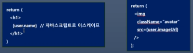
- 예제에는 App.js에 Profile component를 작성했지만, 별도의 component로 만들어 보겠습니다.
- Profile component가 완성되면 App.js에서 호출하고, 출력을 확인합니다.
- 예제에서 style={{}}은 특별한 문법이 아니라,style={}의 중괄호 안에 user 객체를 {}로 표시한 것입니다.
- 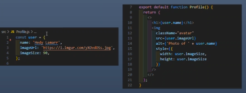
- profile 만들기

  ```javascript
  import "./Profile.css";
  const user = {
    name: "Hedy Lamarr",
    imageUrl: "https://i.imgur.com/yXOvdOSs.jpg",
    imageSize: 90,
  };

  export default function Profile() {
    return (
      <>
        <div className="main">
          <h1>{user.name}</h1>
          
        </div>
      </>
    );
  }
  ```

### 조건부 렌더링

- 일반적인 자바스크립트 코드를 작성할 때 사용하는 것과 동일한 방법을 사용

  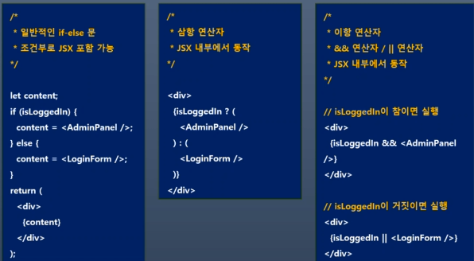

### 리스트 렌더링하기

- 컴포넌트 리스트를 렌더링 하기 위해서는 for문 및 map()함수 사용

- <li>에 key속성 이있음
- 목록을 사용할때는 각 항목에 대해
  고유하게 식별하는 문자열 또는 숫자전달해야함
- 항목을 삽입,삭제 또는 재정렬할 때 key를 사용
- 이것을 key props라고 함.
  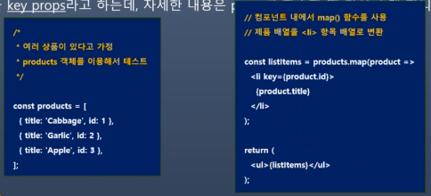

## 3월20일(3주차)

오늘 배운 내용

### 구조 및 역할

- 
- node modules

  - 초기 node module 및 새로 설치하는 패키지가 저장됩니다.

  - 초기파일 37.352 / 폴더 4.597 / 용량은 200MB로 엄청난 양의 파일이 존재 합니다.

- src/App.js
  - 메인 component로 필요한 sub component를 모아서 관리합니다.
  - 출력을 위해서 index.js로 전달됩니다.
- src/App.css
  - App.js에 적용되는 스타일을 정의하는 스타일 파일입니다.
- src/index.js
  - React 앱의 진입 점 으로 최종 렌더링의 되는 곳입니다.
  - ReactDOM.createRoot를 사용하여 App.js를 렌더링합니다.
- src/index.css
  - 전역 스타일을 정의하는 스타일 파일입니다.

### 의존성 관리와 package.json

- package.json은 패키지의 의존성을 관리하는 파일입니다.

- 의존성(Dependency) 이란 , 하나의 소프트웨어가 다른 소프트웨어(라이브러리, 패키지, 모듈 등)에 의존하여 동작하는 관계를 말합니다.
- 즉, 어떤 프로젝트에 사용된 각종 패키지 등의 버전을 동일하게 유지하기 위한 것입니다.
- 협업을 할 때는 팀원들 각자의 컴퓨터에 같은 패키지들을 설치해서 동일한 개발환경을 구성해야 합니다.
- [의존성을 관리하는 이유]
  - 손쉬운 설치 및 업데이트
  - 일관된 개발 환경 유지
  - 중복 설치 방지
- [ package.json을 유지해야 하는 이유]

  1. 프로젝트의 의존성 정보 제공

  - 어떤 패키지 사용하는지 정의
  - 어떤 패키지 설치해야 하는 지 알 수 있는 기준이 됨.

  2. 버전 범위 설정 가능

  - 최신패치버전, 정확한 버전 고정 가능
  - 원하는 방식으로 유연하게 관리

  3. 스크립트와 메타데이터 저장

  - script 속성으로 빌드, 테스트, 실행 등의 명령어 저장
  - 프로젝트 실행

  4. 새로운 패키지 설치 및 관리

  - package.json에 추가되고 package-lock.json에는 정확한 버전이 기록됨.

- node module의 재설치
  1. node modules 폴더와 package-lock.json 파일 삭제  
     `rm -rf node_modules package-lock.json`
  2. npm 패키지의 임시 저장소인 cache를 초기화  
     `npm cache clean --force`
  3. 패키지를 다시 설치합니다.
     `npm install`
  - package-lock.json을 삭제하는 이유
    1. package-lock.json이 손상되었거나, 잘못된 의존성이 있을때
    2. 최신 버전의 패키지를 다시 받고 싶을 때
    3. 팀 프로젝트에서 다른 팀원이 이상한 상태로 package-lock.json을 업데이트 했을때

### 개요

- React는 component 단위로 개발하여 레고를 조립하듯이 앱을 완성합니다.
- component는 작은 기능을 실행할 수 있는 하나의 모듈입니다.
- 공식 사이트의 홈에는 component가 어떻게 사용되는지 설명하고 있습니다.
- component가 페이지로 변해가는 과정에 집중
- React 사이트에서 접속

  ```javascript
  function MyButton() {
    return <button>I'm a button</button>;
  }

  export default function MyApp() {
    return (
      <div>
        <h1>Welcome to my app</h1>
        <MyButton />
      </div>
    );
  }
  ```

### Component를 작성하는 JavaScript와 Markup

- React component는 JavaScript 함수입니다.
- 조건에 따라 화면을 표시 if문 사용
- 목록을 표시하고싶다면 map()함수 사용

### 필요한 곳에 상호작용 기능 추가

- React Component는 데이터를 수신 하고 화면에 표시해야 하는 내용을 반환 합니다.
- 사용자의 입력을 받아 새로운 데이터를 component에 전달할 수도 있습니다.
- 이때 리액트는 상호작용을 통해 얻은 새 데이터로 화면을 업데이트 합니다.

  ```javascript
  import React from 'react';

  class ParentComponent extends React.Component {
    render() {
      return <ChildComponent prop1="Mike" prop2="piza">
    }
  }

  function ChildComponent(props) {
    return <h2>This is prop1: {props.prop1}. This is prop2: {props.prop2}.</h2>
  }
  ```

### full-stack App 개발을 도와주는 React Framework

- React는 라이브러리기때문에 component 조합은 되지만, 라우팅 및 데이터 가져오기 방법 등을 규정하지는 않습니다.

- React로 전체앱을 빌드하려면 Next.js 또는 Remix 같은 full-stack React Framework를 사용하는 것이 좋습니다.
- 이를 구현하는 Framework를 사용하면, 서버에서 실행되거나 빌드 중에도 비동기 component에서 데이터를 가져올 수도 있습니다.

### 모든 플랫폼에서 최고의 성능을 발휘하는 React

- 각 플랫폼의 고유한 강점을 활용하여 모든 플랫폼 잘 어울리는 인터페이스 구현 가능

- [웹의 본질에 충실하기]

  - 빠르게 로드되기를 기대

  - 데이터를 가져오는 동안에도 html 스트림 시작 가능, javascript 코드가 로드되기 전에 콘텐츠를 점진적으로 채울 수 있음
  - 클라이언트 측에서는 표준 웹API를 사용해서 렌더링 도중에도 UI를 반응하도록 할 수 있습니다.
  - 빠른 렌더링 도와줌

- [진정한 네이티브 UX를 실현]

  - 자신의 플랫폼과 같은 모양과 느낌

  - React Native 와 Expo를 사용하면 Android,IOS 등을 위한 앱을 React로 빌드 가능
  - 네이티브처럼 보이는 이유는 UI가 네이티브임
  - webview가 아니라 Android 및 IOS view를 사용하기 때문임.
  - React를 사용하면 웹 개발자도 네이티브 개발자도 될 수 있음
  - 사용자 경험의 희생 없이 다양한 플랫폼에 앱 출시 가능
  - 전체 기능 협업을 통해 개발 가능한 팀을 구성 가능

## 3월13일(2주차)

### node.js의 장단점

- 장점

  - 비동기 논 블로킹 I/O로 높은 성능 제공

  - javascript 풀스택 개발이 가능하며 생산성이 향상됨
  - npm의 방대한 생태계를 활용 가능
  - 경량 서버 개발에 적합
  - 실시간 데이터 처리가 강력함

- 단점

  - CPU 집약적인 작업에 부적합 : 싱글 스레드 기반이라 멀티스레딩 성능이 부족함

  - 콜백지옥 문제 : 해결책으로 async/await와 Promise 사용

### React 프로젝트 생성

- 터미널에 npx create-react-app [이름]

### React 서버구동 및 서버중지

- 서버시작 : npm start

- 서버중지 : ctrl+c

### React Project 의 구조 및 역할

- node modules

- public/ : 정적 static 파일을 저장하는 폴더로 , 빌드 시 그대로 유지됨
- src/:React 앱의 주요 코드가 위치하는 폴더
  - app.js : 메인 컴포넌트
  - index.css : 전역 스타일
  - index.js : react 앱의 진입점을 사용하여 app.js를 렌더링함.
- gitignore : Git에 추가하지 않을 파일 목록을 정의.
- package-lock : 설치된 패키지의 버전이 기록된 파일
- package.json : 프로젝트의 의존성 목록과 실행 스크립트 포함된 파일
- README.md : 프로젝트 설명문서
